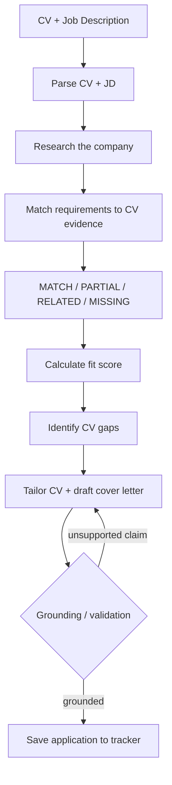

# Job Application Agent

A multi-agent system that takes a candidate's CV and a job description, researches the
target company, scores how well the CV actually supports each requirement of the role,
tailors the CV's emphasis and drafts a cover letter **using only claims already present
in the CV**, and tracks every application it produces in a persistent, local store.

Built for the Arbisoft AI Internship 2026, Phase 3. The approved project specification
is the source of truth for scope and requirements; [docs/ARCHITECTURE.md](docs/ARCHITECTURE.md)
documents the interfaces and design decisions in more depth than this README does.

## The problem it solves

Most "AI resume tools" either rewrite a CV wholesale (inventing whatever the job posting
wants to hear) or return a bare percentage with no explanation. Neither is trustworthy:
the first fabricates experience, and the second gives a candidate nothing to act on.

This project takes a different position: **the CV is the only source of truth about the
candidate.** Every requirement is judged against it individually, with a citation back to
the exact line of evidence used. Nothing the CV doesn't say can become a claim in the
tailored CV or cover letter — that's enforced deterministically, not just asked of the
model politely. The output is a fit report the candidate can actually read and act on:
what's a real match, what's weaker than the role wants, what's merely adjacent, and what
genuinely isn't there yet.

## Status

All of the pipeline stages below are implemented and covered by tests: parsing, company
research, evidence-grounded fit scoring with four match levels, CV gap analysis, tailored
CV and cover letter generation, no-fabrication grounding with bounded retry, persistent
tracking, a Streamlit demo UI, and a custom MCP server. **Not implemented:** a UI for
comparing multiple models side by side, and research caching (see
[Limitations](#limitations)).

## How it works



Grounding sits **between** drafting and saving: nothing the writer produces reaches the
tracker, the screen, or a download button until it has passed the grounding check. If a
draft contains an unsupported claim, the check rejects it, tells the model exactly which
claim failed and why, and the model is asked to rewrite — up to a bounded number of
attempts. If it still can't produce a clean draft, no tailored CV or cover letter is
returned at all, and the fit report (with its gap list) stands on its own.

Orchestrated by a LangGraph `StateGraph` in
[`job_agent/agents/supervisor.py`](job_agent/agents/supervisor.py): `parse_cv` →
`parse_jd` → `research` → `score_fit` → `write_application` → `track_application`.

### The role of the LLM

The design principle throughout is **the model judges, the code decides.** An LLM is
asked narrow, structured questions — "does this evidence support this requirement, and
at what level?", "which CV line backs this claim?" — and returns a schema-validated
answer, never free-form prose the code has to trust blindly. The code then does
everything that has to be reliable: computing the score from the model's judgements,
checking every generated claim against the real CV text, and deciding what gets
persisted. This is why the fit score is explainable (you can point at exactly which
judgement produced it) and why grounding doesn't depend on the model remembering not to
lie — it's checked afterwards, deterministically, every time.

Two model tiers, chosen per step by [`job_agent/llm/router.py`](job_agent/llm/router.py):
a cheap/fast tier for mechanical extraction (parsing, summarising) and a stronger tier
for judgement (scoring, writing). Either tier can be Anthropic or any OpenAI-compatible
endpoint (Groq, Gemini, Ollama, OpenRouter) — see [Configuration](#configuration).

### Technologies used

- **Python 3.11+**, **Pydantic** for every structured output the pipeline passes between
  stages
- **LangGraph** for the supervisor's state graph
- **Anthropic** and **OpenAI-compatible** (Groq / Gemini / Ollama / OpenRouter) clients
  behind one provider-agnostic interface
- **Streamlit** for the demo UI
- **MCP** (Model Context Protocol) for exposing the tracker and pipeline as tools to
  another client
- **SQLite** for the application tracker, **pypdf** for PDF text extraction, **httpx**
  for the web-search call
- **pytest** / **ruff** for testing and linting

## Fit scoring: four match levels

Early in development, fit scoring only had two states: met or unmet. That collapsed three
genuinely different situations into one — "the CV explicitly states this," "the CV shows
something real but at a lower level than asked for," and "the CV never touches this at
all" all became the same "unmet" — which produced fit reports that were misleading rather
than merely incomplete. Scoring now uses four levels instead:

| Level | Meaning |
| --- | --- |
| **MATCH** | The CV clearly satisfies the requirement, including the proficiency level asked for. |
| **PARTIAL** | Real evidence of the *same* skill exists, but at a lower proficiency than the requirement asks for (e.g. "an online Python course" against "strong understanding of Python"). |
| **RELATED** | The CV contains genuinely adjacent evidence — coursework, a different kind of project — that doesn't itself demonstrate the specific requirement. |
| **MISSING** | No reliable evidence for the requirement exists anywhere in the CV. |

**"MISSING" means "not evidenced in the CV" — it does not mean "the candidate definitely
lacks the skill."** A CV is an incomplete record of a person; the agent can only judge
what's written down, and the report says exactly that, deliberately, rather than implying
a conclusion about the candidate the evidence can't support. This distinction is central
to the project's no-fabrication design: the system is honest about the *evidence*, not
in the business of asserting facts about the *candidate* it can't verify.

Each judgement is made by the model — asked to name the CV evidence index behind it and
explain the choice in one sentence — and then validated deterministically: a claimed
match without a real evidence citation is downgraded to MISSING before it can affect the
score. The score itself is computed in code, not asked of the model: each requirement
earns its weight (must-have counts double nice-to-have) times its match strength (MATCH
= 1.0, PARTIAL = 0.5, RELATED = 0.25, MISSING = 0.0), summed and normalised. See
[`job_agent/agents/scoring.py`](job_agent/agents/scoring.py).

## CV gap analysis

The fit report groups every judged requirement into four sections — **Strengths /
Matches**, **Partial matches**, **Related evidence**, **Missing from CV** — using
wording such as *"Not mentioned in the CV — no reliable evidence found"* rather than
*"you don't have this skill"*, for the same reason MISSING means what it means above.

This is a direct grouping of the same `requirement_matches` data the fit score is
computed from — **it is not a second, independent LLM analysis**:

```
match_level == "match"    -> Strengths / Matches
match_level == "partial"  -> Partial matches
match_level == "related"  -> Related evidence
match_level == "missing"  -> Missing from CV
```

One judgement, one source of truth: the same structured answer that produces the score
also produces the gap report, so the two can never disagree with each other.

## Grounding: how unsupported claims are caught

The writing agent may reorder, re-emphasise, and reword the candidate's real content. It
may never introduce a job, project, skill, technology, employer, qualification, metric,
or duration the CV doesn't state. This is checked, not just requested:

**The system validates every generated claim against the available CV evidence, and
retries generation when a claim isn't supported** — it does not simply ask the model to
be careful and trust the result.

- **CV parsing** drops any line the model didn't copy verbatim from the source CV, so
  the reference the rest of the system checks against is never itself invented.
- **Scoring** lets the model cite only an *index* into that evidence, never write
  evidence text; a citation that doesn't resolve to a real line is discarded.
- **Research** discards any fact that doesn't cite a real search result, or that states
  a number the cited result doesn't contain.
- **Writing** checks every generated bullet and cover-letter sentence against the CV
  (and, for statements about the company specifically, the verified research brief —
  the two are never merged). An unsupported claim is rejected, the model is told exactly
  which claim failed and why, and it rewrites — up to a bounded number of attempts. If it
  still can't produce a clean draft, nothing is returned rather than something unverified.

This makes fabrication *detectable and rejected*, not impossible to attempt — the model
can still draft something ungrounded; the difference is that draft never reaches the
tracker or the screen unrejected. See [docs/ARCHITECTURE.md](docs/ARCHITECTURE.md)
(D8–D10) for why grounding is a separate layer from schema validation, and
[`job_agent/validation/grounding.py`](job_agent/validation/grounding.py) for the
implementation.

### Two evidence domains

The cover letter may cite the researched company; the candidate's claims may not.

| Domain | Corpus | Supports |
| --- | --- | --- |
| **Candidate** | CV raw text, parsed evidence, listed skills, candidate name | every claim about the candidate's experience, skills, education, employers, certifications and metrics |
| **Company** | the verified company brief — summary, facts, source titles | statements about the company only |

They are never merged. So `"Arbisoft uses Django"` lets the letter say *"your company uses
Django"* or *"your Django work interests me"*, and never *"I have Django experience"* —
unless Django is independently in the CV. The tailored CV is checked against the
candidate domain alone. A claim whose subject is not clearly the employer defaults to the
strict candidate domain, and the advertised role title grants no evidence either: a role
called "Kubernetes Engineer" does not make Kubernetes claimable.

## Company research

The research agent searches for the *company itself*, not the job posting, and produces
a short factual brief with sources. Results that never mention the company are discarded
before the model ever summarises them, and any fact the summary states must be traceable
to a real retrieved result — a number the source didn't contain is dropped, the same way
an unsupported CV claim is. Research is best-effort: if it fails or no company is named,
the run continues without it (the fit report is unaffected — nothing about candidate fit
depends on the company brief) and the UI says so plainly rather than showing a blank
section.

## Application tracker

Every application is saved as a **draft** — the agent never marks anything submitted, and
nothing is sent anywhere. The tracker view says so on screen.

**Each run creates a new, distinct tracked record, by design.** Application IDs are
randomly generated rather than derived from role or company, specifically so the same
candidate applying to two different roles at one company — or re-running the same
role — produces separate records rather than silently overwriting one. Running the
pipeline against the same CV and job posting multiple times (which happens naturally
while testing, or when a candidate wants to compare runs) is expected to add multiple
rows, not a bug to fix or a case for deduplication. See
[`job_agent/agents/supervisor.py`](job_agent/agents/supervisor.py) (`new_application_id`).

## Layout

| Path | Responsibility |
| --- | --- |
| `job_agent/models/` | Pydantic structured outputs: parsed CV/JD, company brief, fit report (incl. `MatchLevel`), tracker record |
| `job_agent/llm/` | Provider-agnostic model clients + tier routing (cheap model for parsing, strong model for judgement) |
| `job_agent/agents/` | `BaseAgent`, LangGraph supervisor, research / scoring / writing workers |
| `job_agent/tools/` | Narrow, independently testable tools and the registry agents are given |
| `job_agent/memory/` | Persistent application tracker + per-run session context |
| `job_agent/validation/` | Schema guard with bounded retry, plus the no-fabrication grounding checker |
| `job_agent/observability/` | Trace events per tool/model call with latency and token counts |
| `job_agent/mcp_server/` | Custom MCP server exposing the tracker as a resource plus tracker/search tools |
| `job_agent/app/` | Streamlit demo surface — `ui.py` holds the view logic, `streamlit_app.py` is the entry point |
| `tests/` | Unit tests per component + fixtures for the end-to-end run |
| `docs/ARCHITECTURE.md` | Interfaces and design decisions in more depth than this README |

## Setup

```bash
python -m venv .venv && .venv/Scripts/activate
```

```bash
pip install -r requirements.txt
```

```bash
cp .env.example .env
```

## Configuration

`.env.example` is a template holding placeholders only — copy it to `.env` and fill in
your own values there.

> **`.env` is gitignored and must stay that way.** Never commit real API keys, and never
> paste them into source files, the README, or `.env.example`. Everything under `data/`
> is ignored too, so a CV or job posting kept there is not committed either.

| Variable | Required? | Purpose |
| --- | --- | --- |
| `HEAVY_PROVIDER` | optional (defaults to `anthropic`) | `anthropic` or `openai_compatible` — which client the heavy tier (scoring, writing) uses |
| `ANTHROPIC_API_KEY` | required if `HEAVY_PROVIDER=anthropic` | credential for the heavy tier |
| `HEAVY_BASE_URL`, `HEAVY_API_KEY`, `HEAVY_MODEL` | required if `HEAVY_PROVIDER=openai_compatible` | endpoint, credential and model for the heavy tier on any OpenAI-compatible provider (e.g. Gemini) — `HEAVY_API_KEY` takes priority over `ANTHROPIC_API_KEY` when both are set |
| `LIGHT_PROVIDER`, `LIGHT_BASE_URL`, `LIGHT_MODEL` | required | the light tier (parsing, summarising) is always OpenAI-compatible — any endpoint works (Groq, Ollama, OpenRouter) |
| `LIGHT_API_KEY` | required for a hosted endpoint; optional for a local one (e.g. Ollama, which ignores it) | credential for the light tier |
| `SEARCH_PROVIDER`, `SEARCH_API_KEY` | recommended, not required | `serpapi` or `brave`. Without a key the run still completes; research is skipped and the run says so |
| `TRACKER_DB_PATH`, `TOOL_CALL_LOG_PATH` | optional | default to `data/applications.db` and `data/tool_calls.log` |

**No key of any kind is needed to run the tests** — every test uses stubs, and none makes
a network call.

## Running the demo UI

```bash
python -m streamlit run job_agent/app/streamlit_app.py
```

It opens at `http://localhost:8501`. Supply a CV on the left and a job description on
the right — paste the text, or upload a `.txt`, `.md` or `.pdf` (an upload wins over the
box). Uploaded PDFs are handed to the pipeline's own loader as a file and deleted once
the run finishes; the UI never parses a document itself.

**Run application** runs the same supervisor pipeline described above, then shows:

| Section | Shows |
| --- | --- |
| Pipeline | which stages ran, each with its real duration from the trace, plus call count, elapsed time and token totals |
| Fit report | overall fit score, grouped into Strengths / Matches, Partial matches, Related evidence, and Missing from CV, each with the CV evidence and reason behind it |
| Company research | the brief's summary, its facts, and every source it cites, as links |
| Tailored CV | the tailored bullets and anything de-prioritised |
| Cover letter | the drafted letter |
| Validation | what each grounding guard rejected, in plain words, and how many malformed responses were regenerated |
| Application tracker | the record just saved, plus every application tracked so far |

The tailored CV and the cover letter each have a download button; both are plain text.
Every application is stored as a **draft** — the UI submits nothing anywhere.

A run takes roughly a minute and the browser is blocked while it happens. The result is
kept in session state afterwards, so downloading a document or editing the inputs does
not discard it; clicking **Run application** again replaces it with a new run.

The sidebar reports which model each tier will use and whether each credential is set —
never a value. **Run application** is disabled when a tier can't actually be built: the
`anthropic` provider needs an API key, and an `openai_compatible` provider needs a base
URL (its key is optional, since a local runtime such as Ollama ignores it). A missing
search key never blocks a run — research is skipped and the run says so.

## Running the pipeline directly

The pipeline can also be driven without the UI:

```python
from job_agent.agents import build_supervisor
from job_agent.config import load_settings

context = build_supervisor(load_settings()).run("path/to/cv.pdf", "path/to/jd.txt")

print(context.job.role, context.job.company, context.job.location)
print(context.fit_report.overall_fit, context.fit_report.gaps)
for match in context.fit_report.requirement_matches:
    print(match.match_level, match.requirement, "->", match.reason)
print(context.application.application_id, context.application.status)
print(context.warnings, context.trace.totals())
```

Both arguments accept raw text or a path to a `.pdf`, `.txt` or `.md` file.

## Using the tracker over MCP

The application pipeline is exposed over the Model Context Protocol, so another
client — Claude Code, an IDE, a colleague's script — can read and update it without
importing this package.

```bash
python -m job_agent.mcp_server.server
```

| Kind | Name | Does |
| --- | --- | --- |
| resource | `applications://all` | every tracked application, newest first, as JSON |
| tool | `list_applications(status?)` | list, optionally filtered by status |
| tool | `get_application(application_id)` | fetch one; errors if the id is unknown |
| tool | `track_application(role, company, fit_score, status?)` | record a new application, `draft` by default |
| tool | `set_application_status(application_id, status)` | move it along the pipeline |
| tool | `search_company(query, max_results?)` | web search, returning `{title, url, snippet}` |
| tool | `score_fit(cv, job_description)` | parses both and runs the scoring agent → fit report |
| tool | `tailor_application(cv, job_description)` | the above plus the writing agent → fit report, tailored CV, cover letter |

`cv` and `job_description` accept raw text or a path to a `.txt`/`.md`/`.pdf` file.

> **The last two tools cost model quota** — three and four calls respectively, plus a
> retry per malformed or ungrounded response. They run on the **light** tier by default,
> whatever that is configured to be, so an MCP call never quietly bills the expensive
> provider. `MCP_MODEL_TIER=heavy` opts in.

`tailor_application` is one tool rather than two because tailoring the CV and drafting
the letter are a single model call here; splitting them would double the cost or force
the server to hold state. The no-fabrication guarantee applies unchanged — the tailored
CV is checked against the candidate's CV alone, and no company research is performed, so
an MCP caller cannot inject unverified "company facts".

To register it with Claude Code, add to `.mcp.json`:

```json
{
  "mcpServers": {
    "job-application-agent": {
      "command": "python",
      "args": ["-m", "job_agent.mcp_server.server"],
      "cwd": "/absolute/path/to/job-application-agent"
    }
  }
}
```

The server reads `TRACKER_DB_PATH` and the search settings from the same `.env` the
pipeline uses. It returns no configuration values, and it cannot submit an application
anywhere — status changes only ever record a decision a human has already made.

## Where data is stored

| What | Where | Committed? |
| --- | --- | --- |
| Tracked applications (SQLite) | `data/applications.db` | no |
| Tool/model call trace log (JSON lines) | `data/tool_calls.log` | no |
| In-memory trace for one run | `context.trace.events` / `.totals()` | n/a |

## Tests

```bash
python -m pytest -q
```

```bash
python -m ruff check .
```

```bash
python -m pytest --cov=job_agent --cov-report=term-missing
```

No test requires an API key, network access, or `.env` — every provider call is stubbed.

## Limitations

- **No multi-model comparison UI.** Both tiers can be configured independently (see
  Configuration above), but there is no side-by-side view comparing what two different
  models would produce for the same run.
- **No research caching.** Each run performs a fresh company search; repeated runs
  against the same company don't reuse a prior result.
- **The fit-scoring rubric has a known edge case, fixed but not re-verified live.** A
  live run showed the scorer occasionally treating evidence about one subject (e.g.
  basic CSS/HTML knowledge) as partial support for an unrelated requirement (e.g. "basic
  understanding of APIs") — the model's own stated reason for the judgement often
  contradicted the level it chose. This has been addressed with an explicit
  subject-relevance-before-proficiency rule in the scoring prompt
  ([`job_agent/agents/scoring.py`](job_agent/agents/scoring.py)) and is covered by
  regression tests, but the fix has not been re-confirmed against a further live model
  call — like any prompt-level fix to LLM behaviour, it narrows the failure mode rather
  than eliminates it by construction.
- **Grounding rejects, it doesn't prove innocence.** The system validates every generated
  claim against the CV and retries when a claim is unsupported; it cannot guarantee a
  model will never attempt to draft an ungrounded claim, only that such a claim is
  checked and rejected before it reaches the tracker or the screen.
- **A run takes roughly a minute**, mostly spent on the writing stage's grounding-retry
  loop; the Streamlit UI blocks synchronously for that duration.
- No automated benchmark or accuracy measurement exists for fit-scoring quality — results
  described in this document come from unit/integration tests (offline, stubbed) and
  manual live runs, not a formal evaluation set.
