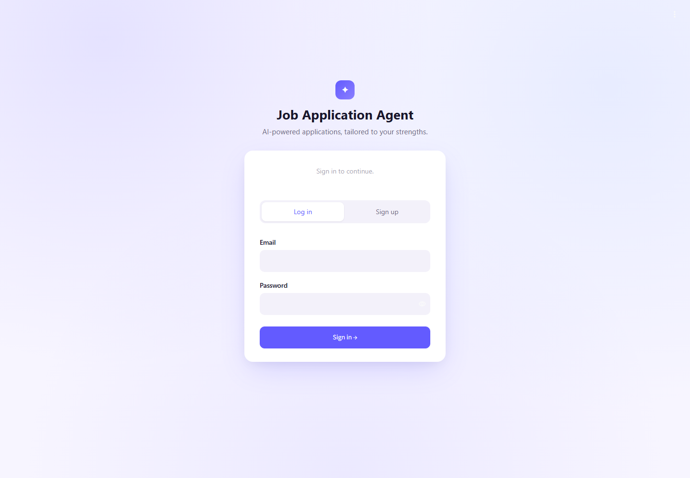
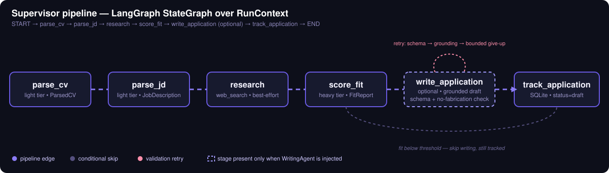
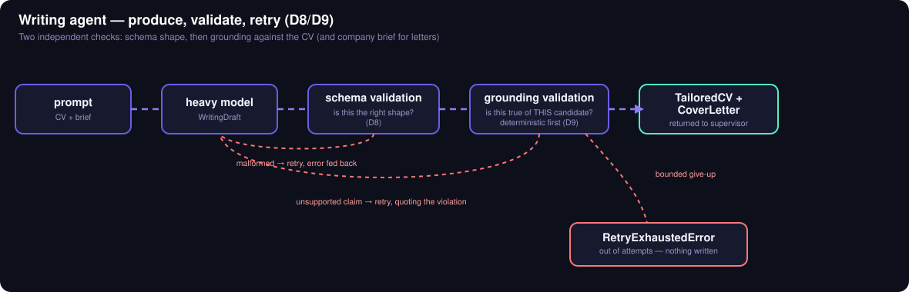
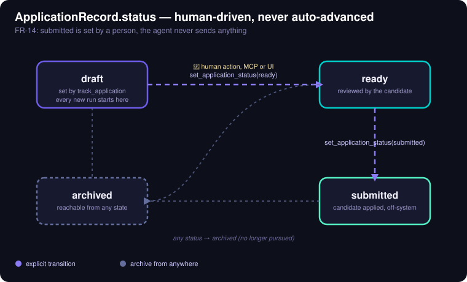

# Job Application Agent

Give it your CV and a job posting. It researches the company, then scores exactly how
well your CV supports each requirement — a real match, a partial match, related
evidence, or genuinely missing, never a blind percentage. It tailors your CV and drafts
a cover letter using only what your CV already proves, checking every generated sentence
against your real CV text before it's shown to you. Every application is saved to a
local tracker as a draft — nothing is ever sent anywhere automatically. Built with
LangGraph, Pydantic, and a provider-agnostic model layer (Anthropic or any
OpenAI-compatible endpoint), with a Streamlit UI and an MCP server exposing the same
pipeline as tools.

**588 tests passing, 96% coverage, Ruff clean.**

<p align="center">
  
</p>

## Setup

```bash
python -m venv .venv && .venv/Scripts/activate
pip install -r requirements.txt
cp .env.example .env
```

Open `.env` and fill in your keys — at minimum one heavy-tier provider (e.g.
`ANTHROPIC_API_KEY`) and one light-tier provider (e.g. Groq via `LIGHT_BASE_URL` +
`LIGHT_API_KEY`). `.env.example` explains every variable. `.env` is gitignored — never
commit real keys.

## Run it

```bash
python -m streamlit run job_agent/app/streamlit_app.py
```

Opens at `http://localhost:8501`. Paste or upload a CV and a job description, then click
**Run application**.

## Run it with Docker

```bash
cp .env.example .env   # fill in your keys first, same as above
docker compose up --build
```

Opens at `http://localhost:8501`. The SQLite tracker db and trace log persist across
restarts in `./data` on the host; `.env` is passed in at container start, never baked
into the image.

The MCP server isn't part of `docker compose up` (it talks over stdio, not a network
port, so it isn't a long-running service) - run it on demand instead:

```bash
docker compose run --rm mcp
```

## Run the tests

```bash
python -m pytest -q
python -m ruff check .
```

No API key needed — every model and search call is stubbed.

## How it works

The supervisor runs a fixed LangGraph `StateGraph` — deterministic routing, no LLM call
spent deciding what happens next. Writing is the one optional stage, skipped whenever
fit is below threshold; the retry loop shown here is the actual no-fabrication guard,
not a diagram simplification.

<p align="center">
  
</p>

Every generated line has to survive two independent checks before it reaches you — shape
first, then whether it's actually true of *this* candidate:

<p align="center">
  
</p>

Nothing is ever auto-submitted. `status` only moves when a human calls
`set_application_status` — from the UI or over MCP — never as a side effect of a
pipeline run:

<p align="center">
  
</p>

## Want the full picture?

- **[docs/PROJECT_EXPLANATION.md](docs/PROJECT_EXPLANATION.md)** — the complete
  plain-language walkthrough: how scoring and grounding actually work, every pipeline
  stage, known limitations, and a mentor Q&A.
- **[docs/ARCHITECTURE.md](docs/ARCHITECTURE.md)** — interfaces and the design
  decisions behind them.
